# 数据库 ER 图

> 污染场地土壤生态-生产功能重构监管系统 (SRS) -- 22 表实体关系

```mermaid
erDiagram
    %% ========================
    %% 认证与权限模块 Auth
    %% ========================
    organizations {
        int id PK
        string name
        string org_type "enterprise/agency/regulator/admin"
        string credit_code
        string status
        timestamp created_at
        timestamp updated_at
    }

    users {
        int id PK
        string username UK
        string password_hash
        string display_name
        int organization_id FK
        string email
        string phone
        string status
        timestamp last_login_at
        timestamp created_at
        timestamp updated_at
    }

    roles {
        int id PK
        string code UK "admin/enterprise/agency/regulator"
        string name
        string description
    }

    permissions {
        int id PK
        string code UK "data:input/report:generate..."
        string name
        string category
    }

    user_roles {
        int user_id PK_FK
        int role_id PK_FK
    }

    role_permissions {
        int role_id PK_FK
        int permission_id PK_FK
    }

    audit_logs {
        int id PK
        int user_id FK
        string action
        string resource_type
        int resource_id
        string result
        string ip
        string user_agent
        json detail
        timestamp created_at
    }

    %% ========================
    %% 场地与检测数据模块 Site
    %% ========================
    sites {
        int id PK
        string site_code UK
        string name
        int organization_id FK
        string pollution_type "heavy_metal/organic/composite"
        string land_use_type
        string risk_level
        string province
        string city
        string district
        decimal longitude
        decimal latitude
        float area
        text description
        string status
        timestamp created_at
        timestamp updated_at
    }

    sampling_points {
        int id PK
        int site_id FK
        string point_code
        decimal longitude
        decimal latitude
        float depth_top_cm
        float depth_bottom_cm
        string soil_type
        string region
        date sampled_at
        timestamp created_at
    }

    factor_dictionary {
        int id PK
        string factor_code UK
        string factor_name
        string level1_category "化学性质/肥力指标/重金属/有机物"
        string factor_type "pollutant/soil_property/nutrient"
        string default_unit
        text description
        string source
        timestamp created_at
        timestamp updated_at
    }

    measurements {
        int id PK
        int site_id FK
        int sampling_point_id FK
        int factor_id FK
        float value
        string unit
        string method
        boolean is_below_detection
        string source_file
        int import_batch_id FK
        date detected_at
        timestamp created_at
    }

    import_batches {
        int id PK
        int site_id FK
        string source_file
        json mapping_snapshot
        int row_count
        int valid_count
        int invalid_count
        json validation_report
        string script_version
        string status
        int imported_by FK
        timestamp created_at
    }

    threshold_rules {
        int id PK
        int factor_id FK
        string application_scenario
        string applicable_scope "production/ecology"
        string land_type
        float threshold_min
        float threshold_max
        string unit
        text threshold_original "原始阈值文本如 pH<=5.5,<=30mg/kg"
        string standard_source
        string version
    }

    standard_thresholds {
        int id PK
        int factor_id FK
        string factor_name
        string land_use_type
        string standard_code
        string standard_name
        float screening_value
        float intervention_value
        float control_value
        string unit
        string pH_condition
        string soil_condition
        string exposure_scenario
        date effective_date
        string version
        string source_reference
        text notes
    }

    %% ========================
    %% ML 与算法模块 ML
    %% ========================
    ml_models {
        int id PK
        string model_name
        string version
        string algorithm
        json feature_list
        string training_data_version
        json metrics
        string artifact_path
        timestamp trained_at
        timestamp created_at
    }

    diagnosis_results {
        int id PK
        int site_id FK
        int model_id FK
        string data_version
        int top_n
        text summary
        json shap_global
        string status
        timestamp created_at
    }

    diagnosis_factor_details {
        int id PK
        int diagnosis_id FK
        int factor_id FK
        int sampling_point_id FK
        float importance
        float shap_value
        string direction "positive/negative"
        int rank
        timestamp created_at
    }

    evaluation_results {
        int id PK
        int site_id FK
        string eval_type "reconstruction_prod/eco/ssui"
        string data_version
        string param_version
        float score
        string grade
        json dimensions
        json weights
        json limiting_factors
        json risk_factors
        text explanation
        timestamp created_at
    }

    %% ========================
    %% 推荐与技术库模块 Workflow
    %% ========================
    technology_library {
        int id PK
        string tech_name
        json applicable_pollutants
        text applicable_soil
        json applicable_land_type
        string applicable_stage
        text advantages
        text limitations
        string cost_level
        string duration_level
        text secondary_risk
        text forbidden_conditions
        string source
        timestamp created_at
        timestamp updated_at
    }

    remediation_case_library {
        int id PK
        string case_id UK
        string site_type
        string region
        string land_use
        string pollution_type
        text pollutants
        text concentration_range
        text soil_conditions
        string remediation_technology
        string technology_category
        string duration
        string cost_level
        text effectiveness
        text limitation
        text secondary_risk
        text post_remediation_function
        string evidence_source
        string doi
        text notes
        timestamp created_at
    }

    recommendations {
        int id PK
        int site_id FK
        int technology_id FK
        int diagnosis_factor_id FK
        string rule_version
        float match_score
        text reason
        int rank
        timestamp created_at
    }

    %% ========================
    %% 流程与报告模块 System
    %% ========================
    workflow_records {
        int id PK
        int site_id FK
        string stage "survey/approval/construction/effect/maintenance"
        string status
        int operator_id FK
        timestamp operated_at
        text review_comment
        string version
        string data_source
        boolean is_completed
        boolean is_returned
        boolean advanced_to_next
        json payload
        timestamp created_at
        timestamp updated_at
    }

    workflow_attachments {
        int id PK
        int workflow_record_id FK
        int file_object_id FK
        string file_role
        timestamp created_at
    }

    file_objects {
        int id PK
        string storage_key
        string original_name
        string content_type
        int size_bytes
        string sha256
        int organization_id FK
        timestamp created_at
    }

    report_records {
        int id PK
        int site_id FK
        string report_type
        string version
        json data_snapshot
        string template_version
        int file_object_id FK
        int generated_by FK
        timestamp generated_at
        timestamp created_at
    }

    %% ========================
    %% 关系定义
    %% ========================

    %% Auth 模块关系
    organizations ||--o{ users : "1对多: 企业下有多个用户"
    organizations ||--o{ sites : "1对多: 企业拥有多个场地"
    users ||--o{ user_roles : "1对多"
    roles ||--o{ user_roles : "1对多"
    roles ||--o{ role_permissions : "1对多"
    permissions ||--o{ role_permissions : "1对多"
    users ||--o{ audit_logs : "1对多: 用户产生操作日志"

    %% Site 模块关系
    sites ||--o{ sampling_points : "1对多: 场地包含多个采样点"
    sites ||--o{ measurements : "1对多: 场地有检测数据"
    sampling_points ||--o{ measurements : "1对多: 采样点有检测数据"
    factor_dictionary ||--o{ measurements : "1对多: 因子对应用检测值"
    factor_dictionary ||--o{ threshold_rules : "1对多: 因子有多条阈值规则"
    factor_dictionary ||--o{ standard_thresholds : "1对多: 因子有多条标准阈值"
    sites ||--o{ import_batches : "1对多: 场地有多次导入"
    import_batches ||--o{ measurements : "1对多: 导入批次含检测数据"
    users ||--o{ import_batches : "导入人"

    %% ML 模块关系
    sites ||--o{ diagnosis_results : "1对多: 场地有诊断结果"
    ml_models ||--o{ diagnosis_results : "1对多: 模型产诊断结果"
    diagnosis_results ||--o{ diagnosis_factor_details : "1对多: 诊断含因子详情"
    factor_dictionary ||--o{ diagnosis_factor_details : "1对多"
    sampling_points ||--o{ diagnosis_factor_details : "1对多: 局部解释按点位"
    sites ||--o{ evaluation_results : "1对多: 场地有评价结果"

    %% Workflow 模块关系
    sites ||--o{ recommendations : "1对多: 场地有推荐方案"
    technology_library ||--o{ recommendations : "1对多: 技术被推荐"
    diagnosis_factor_details ||--o{ recommendations : "1对多: 诊断因子对应推荐"

    %% System 模块关系
    sites ||--o{ workflow_records : "1对多: 场地有五阶段追溯"
    users ||--o{ workflow_records : "1对多: 操作人"
    workflow_records ||--o{ workflow_attachments : "1对多: 阶段含附件"
    file_objects ||--o{ workflow_attachments : "1对多: 文件作为附件"
    organizations ||--o{ file_objects : "1对多: 企业拥有文件"
    sites ||--o{ report_records : "1对多: 场地有报告"
    file_objects ||--o{ report_records : "1对多: 文件作为报告载体"
    users ||--o{ report_records : "生成人"
```



## 模块分组

| 模块 | 表数 | 包含表 |
|------|------|--------|
| **Auth (认证权限)** | 7 | `organizations`, `users`, `roles`, `permissions`, `user_roles`, `role_permissions`, `audit_logs` |
| **Site (场地数据)** | 8 | `sites`, `sampling_points`, `factor_dictionary`, `measurements`, `import_batches`, `threshold_rules`, `standard_thresholds` |
| **ML (机器学习)** | 4 | `ml_models`, `diagnosis_results`, `diagnosis_factor_details`, `evaluation_results` |
| **Workflow (推荐追溯)** | 4 | `technology_library`, `remediation_case_library`, `recommendations` |
| **System (系统报告)** | 5 | `workflow_records`, `workflow_attachments`, `file_objects`, `report_records` |

> 注: `remediation_case_library` 为独立表（仅通过 `case_id` 被引用），`standard_thresholds` 通过复合唯一约束 `(standard_code, factor_name, land_use_type, pH_condition, exposure_scenario)` 确保不重复。

## 核心数据关系

```
organizations  ──< users ──< user_roles >── roles ──< role_permissions >── permissions
       │
       └──< sites ──< sampling_points ──< measurements >── factor_dictionary ──< threshold_rules
              │                                                                    │
              │         ┌──────────────────────────────────────────────────────────┘
              │         │
              ├──< diagnosis_results ──< diagnosis_factor_details
              │         │
              ├──< evaluation_results
              │
              ├──< recommendations >── technology_library
              │
              ├──< workflow_records ──< workflow_attachments >── file_objects
              │
              └──< report_records >── file_objects
```
