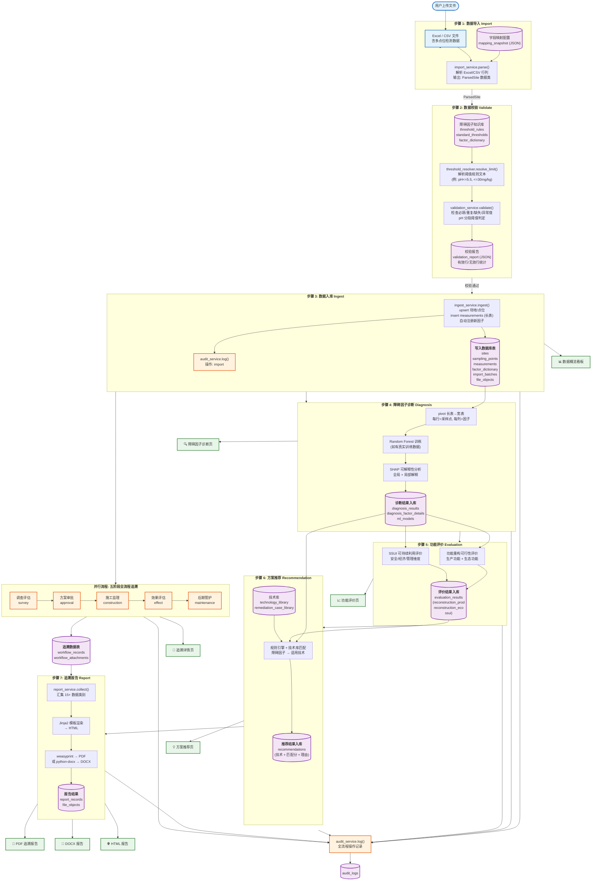

# 数据流图

> 污染场地土壤生态-生产功能重构监管系统 (SRS) -- 完整数据流

## 各步骤输入/输出总表

| 步骤 | 输入 | 核心处理 | 输出 | 涉及数据库表 |
|------|------|----------|------|-------------|
| **1. 导入** | Excel/CSV 文件 + 字段映射配置 | `import_service.parse()` | `ParsedSite` (站点元数据 + 点位 + 检测值) | `import_batches` |
| **2. 校验** | `ParsedSite` + 阈值规则 + 因子字典 | `validation_service.validate()` + `threshold_resolver` | 校验报告 (有效/无效/超标标记) | `factor_dictionary`, `threshold_rules`, `standard_thresholds` |
| **3. 入库** | `ParsedSite` + 校验报告 | `ingest_service.ingest()` | 持久化数据 | `sites`, `sampling_points`, `measurements`, `factor_dictionary`, `import_batches`, `file_objects` |
| **4. 诊断** | `measurements` (长表) | RF 训练 + SHAP 解释 | 障碍因子排名 + 全局/局部 SHAP | `ml_models`, `diagnosis_results`, `diagnosis_factor_details` |
| **5. 评价** | 诊断结果 | 重构可行性 + SSUI 计算 | 三类评价得分 + 等级 + 限制因子 | `evaluation_results` |
| **6. 推荐** | 诊断结果 + 评价结果 + 技术库 | 规则引擎匹配 | 推荐技术列表 + 匹配分数 + 理由 | `recommendations`, `technology_library`, `remediation_case_library` |
| **7. 报告** | 所有上游数据 + 五阶段追溯 | Jinja2 模板渲染 + PDF/DOCX 转换 | 追溯报告文件 | `report_records`, `file_objects` |
| **审计** | 所有写入操作 | `audit_service.log()` | 操作记录 | `audit_logs` |
| **追溯** | 场地 + 附件上传 | 五阶段状态管理 | 阶段记录 + 附件 | `workflow_records`, `workflow_attachments`, `file_objects` |

## 数据治理规则

- **raw 数据不可变**：导入的原始文件通过 `file_objects` (SHA-256) 存档，不覆写
- **派生表标识**：所有计算结果标注 `data_version` / `param_version` / `model_id`
- **真实切分**：ML 训练按 (DOI, Source) 连通分量分配 train/test，双键零交集
- **模拟数据隔离**：模拟数据仅用于训练增强/压力测试，永不进入验证集
