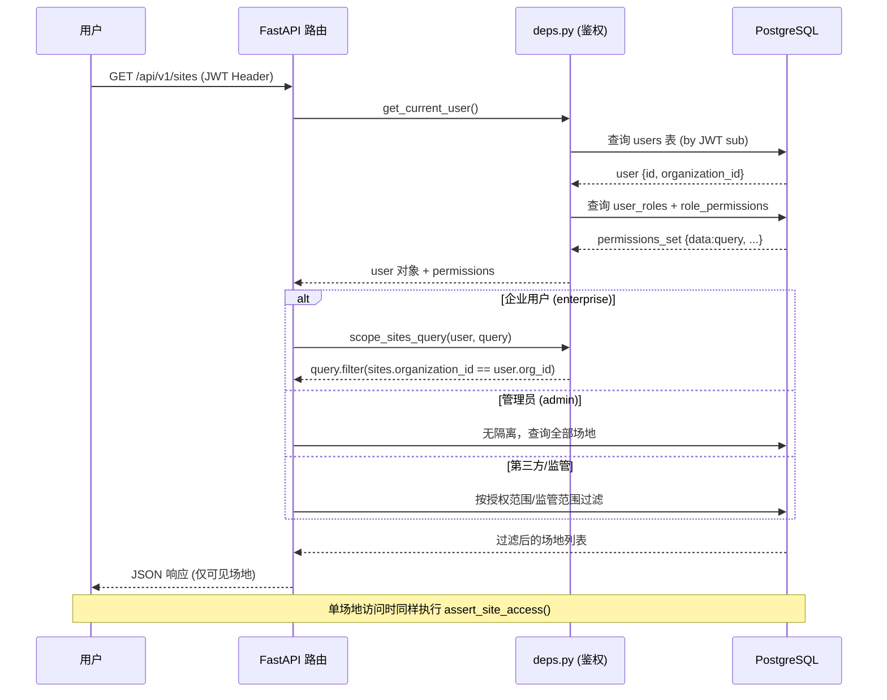

# 权限模型图

> 污染场地土壤生态-生产功能重构监管系统 (SRS) -- RBAC 权限控制

## 四角色 · 十四权限 · 企业数据隔离

```mermaid
graph TB
    %% 样式
    classDef roleAdmin fill:#ffcdd2,stroke:#c62828,stroke-width:2px,color:#b71c1c
    classDef roleEnterprise fill:#c8e6c9,stroke:#2e7d32,stroke-width:2px,color:#1b5e20
    classDef roleAgency fill:#b3e5fc,stroke:#0277bd,stroke-width:2px,color:#01579b
    classDef roleRegulator fill:#fff9c4,stroke:#f57f17,stroke-width:2px,color:#e65100
    classDef permData fill:#e3f2fd,stroke:#1565c0,stroke-width:1px
    classDef permReport fill:#e8f5e9,stroke:#2e7d32,stroke-width:1px
    classDef permSystem fill:#fce4ec,stroke:#c62828,stroke-width:1px
    classDef permTrace fill:#fff3e0,stroke:#e65100,stroke-width:1px
    classDef permFile fill:#f3e5f5,stroke:#7b1fa2,stroke-width:1px
    classDef permML fill:#e0f2f1,stroke:#00695c,stroke-width:1px
    classDef gate fill:#eceff1,stroke:#455a64,stroke-width:2px

    %% ====== 角色 ======
    ROLE_ADMIN["<b>系统管理员</b><br/>admin<br/>全部权限"]:::roleAdmin
    ROLE_ENT["<b>企业用户</b><br/>enterprise<br/>本企业数据"]:::roleEnterprise
    ROLE_AGENCY["<b>第三方机构</b><br/>agency<br/>授权项目数据"]:::roleAgency
    ROLE_REG["<b>监管人员</b><br/>regulator<br/>监管范围数据"]:::roleRegulator

    %% ====== 权限分组 ======
    subgraph DATA_PERMS ["数据权限 (4项)"]
        P_DATA_INPUT["data:input<br/>数据录入"]:::permData
        P_DATA_QUERY["data:query<br/>数据查询"]:::permData
        P_DATA_EXPORT["data:export<br/>数据导出"]:::permData
        P_DATA_ARCHIVE["data:archive<br/>数据归档"]:::permData
    end

    subgraph REPORT_PERMS ["报告权限 (1项)"]
        P_REPORT_GEN["report:generate<br/>报告生成"]:::permReport
    end

    subgraph MAP_PERMS ["地图权限 (1项)"]
        P_MAP_VIEW["map:view<br/>地图查看"]:::permData
    end

    subgraph TRACE_PERMS ["追溯权限 (1项)"]
        P_WF_VIEW["workflow:view<br/>全流程查看"]:::permTrace
    end

    subgraph FILE_PERMS ["文件权限 (1项)"]
        P_FILE_DL["file:download<br/>文档下载"]:::permFile
    end

    subgraph SYS_PERMS ["系统权限 (4项)"]
        P_USER_MGMT["user:manage<br/>用户管理"]:::permSystem
        P_ROLE_MGMT["role:manage<br/>角色管理"]:::permSystem
        P_AUDIT_VIEW["audit:view<br/>日志审计"]:::permSystem
        P_PARAM_CFG["param:config<br/>参数设置"]:::permSystem
    end

    subgraph ML_PERMS ["算法权限 (1项)"]
        P_MODEL_MGMT["model:manage<br/>模型管理"]:::permML
    end

    subgraph DECISION_PERMS ["决策权限 (1项)"]
        P_TECH_MGMT["tech:manage<br/>技术库管理"]:::permML
    end

    %% ====== 角色→权限 分配 ======
    ROLE_ADMIN --> P_DATA_INPUT
    ROLE_ADMIN --> P_DATA_QUERY
    ROLE_ADMIN --> P_DATA_EXPORT
    ROLE_ADMIN --> P_DATA_ARCHIVE
    ROLE_ADMIN --> P_REPORT_GEN
    ROLE_ADMIN --> P_MAP_VIEW
    ROLE_ADMIN --> P_WF_VIEW
    ROLE_ADMIN --> P_FILE_DL
    ROLE_ADMIN --> P_USER_MGMT
    ROLE_ADMIN --> P_ROLE_MGMT
    ROLE_ADMIN --> P_AUDIT_VIEW
    ROLE_ADMIN --> P_PARAM_CFG
    ROLE_ADMIN --> P_MODEL_MGMT
    ROLE_ADMIN --> P_TECH_MGMT

    ROLE_ENT --> P_DATA_INPUT
    ROLE_ENT --> P_DATA_QUERY
    ROLE_ENT --> P_DATA_EXPORT
    ROLE_ENT --> P_REPORT_GEN
    ROLE_ENT --> P_MAP_VIEW
    ROLE_ENT --> P_WF_VIEW
    ROLE_ENT --> P_FILE_DL

    ROLE_AGENCY --> P_DATA_INPUT
    ROLE_AGENCY --> P_DATA_QUERY
    ROLE_AGENCY --> P_WF_VIEW
    ROLE_AGENCY --> P_FILE_DL

    ROLE_REG --> P_DATA_QUERY
    ROLE_REG --> P_REPORT_GEN
    ROLE_REG --> P_MAP_VIEW
    ROLE_REG --> P_WF_VIEW
    ROLE_REG --> P_FILE_DL
    ROLE_REG --> P_AUDIT_VIEW

    %% ====== 权限检查门 ======
    GATE["<b>权限检查门</b><br/>deps.require_permission(code)<br/>deps.assert_site_access(user, site_id)<br/>deps.scope_sites_query(user, query)"]:::gate

    ROLE_ADMIN -.->|"全部权限通过"| GATE
    ROLE_ENT -.->|"本企业数据隔离"| GATE
    ROLE_AGENCY -.->|"授权项目隔离"| GATE
    ROLE_REG -.->|"监管范围隔离"| GATE
```

## 角色-权限映射矩阵

| 权限代码 | 权限名称 | 分类 | 管理员 | 企业用户 | 第三方机构 | 监管人员 |
|----------|----------|------|:------:|:--------:|:----------:|:--------:|
| `data:input` | 数据录入 | 数据 | ✅ | ✅ | ✅ | -- |
| `data:query` | 数据查询 | 数据 | ✅ | ✅ | ✅ | ✅ |
| `data:export` | 数据导出 | 数据 | ✅ | ✅ | -- | -- |
| `data:archive` | 数据归档 | 数据 | ✅ | -- | -- | -- |
| `report:generate` | 报告生成 | 报告 | ✅ | ✅ | -- | ✅ |
| `map:view` | 地图查看 | 数据 | ✅ | ✅ | -- | ✅ |
| `workflow:view` | 全流程查看 | 追溯 | ✅ | ✅ | ✅ | ✅ |
| `file:download` | 文档下载 | 文件 | ✅ | ✅ | ✅ | ✅ |
| `user:manage` | 用户管理 | 系统 | ✅ | -- | -- | -- |
| `role:manage` | 角色管理 | 系统 | ✅ | -- | -- | -- |
| `audit:view` | 日志审计 | 系统 | ✅ | -- | -- | ✅ |
| `param:config` | 参数设置 | 系统 | ✅ | -- | -- | -- |
| `model:manage` | 模型管理 | 算法 | ✅ | -- | -- | -- |
| `tech:manage` | 技术库管理 | 决策 | ✅ | -- | -- | -- |
| **合计** | | | **14** | **7** | **4** | **6** |

## 企业数据隔离流程

## RBAC 实现要点

| 层次 | 实现 | 位置 |
|------|------|------|
| **数据库** | 5 表: `users`, `roles`, `permissions`, `user_roles`, `role_permissions` | `backend/app/models/__init__.py` |
| **种子数据** | `seed_db.py` 初始化 4 角色 + 14 权限 + 3 测试用户 | `backend/app/db/seed_db.py` |
| **认证** | JWT (HS256) + bcrypt 密码哈希 | `backend/app/core/security.py` |
| **鉴权依赖** | `get_current_user()` / `require_permission(code)` / `assert_site_access()` | `backend/app/core/deps.py` |
| **前端路由守卫** | `<Protected>` 组件检查登录状态; `/system` 路由 `<AdminOnly>` | `frontend/src/App.tsx` |
| **前端 API** | axios 拦截器注入 JWT; 401 自动跳转登录页 | `frontend/src/api/client.ts` |
