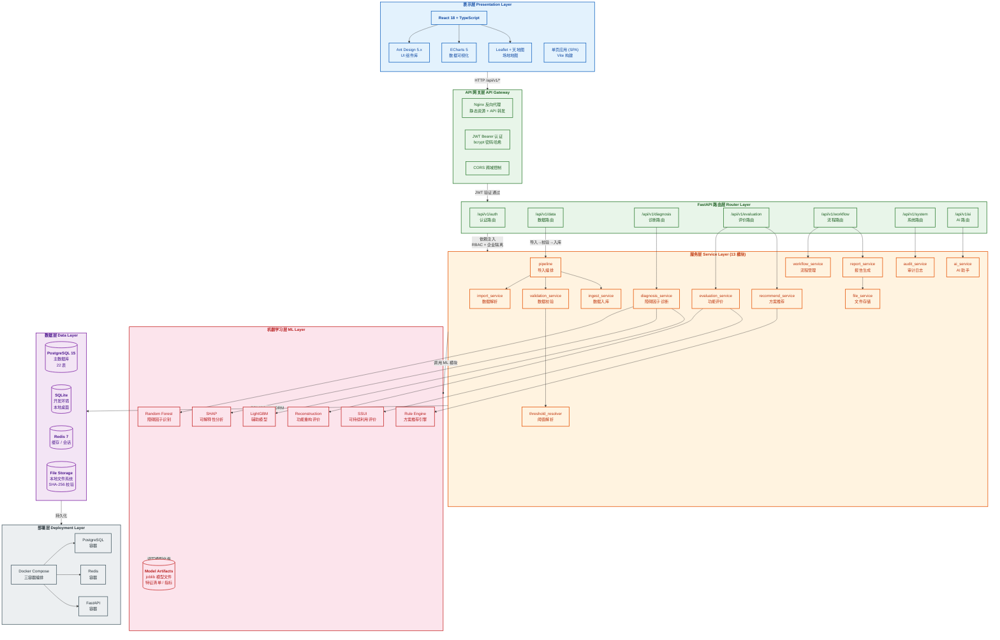

# 系统架构图

> 污染场地土壤生态-生产功能重构监管系统 (SRS) -- 总体分层架构



## 层次说明

| 层次 | 技术栈 | 职责 |
|------|--------|------|
| **表示层** | React 18 + TypeScript + Ant Design 5 + ECharts 5 + Leaflet | 用户界面：数据概览、场地管理、障碍因子分析、功能重构、SSUI、方案推荐、全流程追溯、系统管理 |
| **API 网关** | Nginx + JWT + CORS | 反向代理、认证鉴权、跨域控制 |
| **路由层** | FastAPI (7 路由模块) | RESTful API：auth / data / diagnosis / evaluation / workflow / system / ai |
| **服务层** | Python (13 服务模块) | 业务逻辑：导入管道、阈值解析、诊断、评价、推荐、流程、报告、AI、审计、文件 |
| **数据层** | PostgreSQL / SQLite + Redis + 本地文件系统 | 数据持久化：22 表 ORM、缓存、文件存储 (SHA-256) |
| **ML 层** | scikit-learn + SHAP + LightGBM + 规则引擎 | 障碍因子识别、可解释性、功能评价、可持续利用、方案推荐 |
| **部署层** | Docker Compose + Nginx | 三容器编排：PostgreSQL + Redis + FastAPI |

## 核心数据流

```
用户上传 Excel/CSV
  → import_service 解析 (字段映射)
  → validation_service 校验 (阈值解析 + pH 分段)
  → ingest_service 入库 (长表 measurements)
  → diagnosis_service 诊断 (RF + SHAP)
  → evaluation_service 评价 (重构可行性 + SSUI)
  → recommend_service 推荐 (规则引擎 + 技术库匹配)
  → workflow_service 追溯 (五阶段)
  → report_service 报告 (Jinja2 → PDF/DOCX/HTML)
```
