# 追溯流程图

> 污染场地土壤生态-生产功能重构监管系统 (SRS) -- 五阶段全流程追溯状态机与报告生成

## 五阶段状态机

```mermaid
stateDiagram-v2
    [*] --> 调查评估: init_stages(site_id)

    state 调查评估 {
        [*] --> survey_not_started: 初始状态
        survey_not_started --> survey_completed: is_completed=true
        survey_completed --> survey_returned: is_returned=true
        survey_returned --> survey_completed: 重新提交
    }

    state 方案审批 {
        [*] --> approval_not_started: 初始状态
        approval_not_started --> approval_completed: is_completed=true
        approval_completed --> approval_returned: is_returned=true
        approval_returned --> approval_completed: 重新审批
    }

    state 施工监理 {
        [*] --> construction_not_started: 初始状态
        construction_not_started --> construction_completed: is_completed=true
        construction_completed --> construction_returned: is_returned=true
        construction_returned --> construction_completed: 重新验收
    }

    state 效果评估 {
        [*] --> effect_not_started: 初始状态
        effect_not_started --> effect_completed: is_completed=true
        effect_completed --> effect_returned: is_returned=true
        effect_returned --> effect_completed: 重新评估
    }

    state 后期管护 {
        [*] --> maintenance_not_started: 初始状态
        maintenance_not_started --> maintenance_completed: is_completed=true
        maintenance_completed --> maintenance_returned: is_returned=true
        maintenance_returned --> maintenance_completed: 重新管护
    }

    调查评估 --> 方案审批: advanced_to_next=true
    方案审批 --> 施工监理: advanced_to_next=true
    施工监理 --> 效果评估: advanced_to_next=true
    效果评估 --> 后期管护: advanced_to_next=true
    后期管护 --> [*]: 全流程完成
```



## 阶段详情与数据字段

```mermaid
flowchart TD
    classDef stage fill:#e3f2fd,stroke:#1565c0,stroke-width:2px
    classDef field fill:#fff3e0,stroke:#e65100,stroke-width:1px
    classDef attach fill:#f3e5f5,stroke:#7b1fa2,stroke-width:1px
    classDef report fill:#e8f5e9,stroke:#2e7d32,stroke-width:2px

    subgraph WF ["五阶段追溯工作流"]
        direction LR

        subgraph S1 ["阶段 1: 调查评估 survey"]
            S1_STATUS["status: not_started/完成/退回"]:::field
            S1_FIELDS["场地调查报告<br/>污染源识别<br/>风险评估<br/>采样检测数据"]:::field
            S1_ATTACH["附件: 调查报告文档<br/>检测报告<br/>现场照片"]:::attach
        end

        subgraph S2 ["阶段 2: 方案审批 approval"]
            S2_STATUS["status: not_started/完成/退回"]:::field
            S2_FIELDS["修复方案<br/>技术路线<br/>预算审批<br/>专家评审意见"]:::field
            S2_ATTACH["附件: 修复方案文档<br/>审批文件<br/>专家意见书"]:::attach
        end

        subgraph S3 ["阶段 3: 施工监理 construction"]
            S3_STATUS["status: not_started/完成/退回"]:::field
            S3_FIELDS["施工记录<br/>监理日志<br/>材料检验<br/>进度报告"]:::field
            S3_ATTACH["附件: 施工记录<br/>监理报告<br/>材料检测单<br/>现场影像"]:::attach
        end

        subgraph S4 ["阶段 4: 效果评估 effect"]
            S4_STATUS["status: not_started/完成/退回"]:::field
            S4_FIELDS["修复效果检测<br/>达标判定<br/>残余风险评估<br/>验收结论"]:::field
            S4_ATTACH["附件: 效果评估报告<br/>检测数据<br/>验收文件"]:::attach
        end

        subgraph S5 ["阶段 5: 后期管护 maintenance"]
            S5_STATUS["status: not_started/完成/退回"]:::field
            S5_FIELDS["长期监测计划<br/>管护记录<br/>跟踪检测<br/>制度建议"]:::field
            S5_ATTACH["附件: 管护方案<br/>监测报告<br/>制度文件"]:::attach
        end

        S1 -->|"advanced_to_next"| S2
        S2 -->|"advanced_to_next"| S3
        S3 -->|"advanced_to_next"| S4
        S4 -->|"advanced_to_next"| S5
    end
```



## 工作流数据表结构

| 字段 | 类型 | 说明 |
|------|------|------|
| `id` | int | 主键 |
| `site_id` | int FK | 关联场地 |
| `stage` | string(30) | survey / approval / construction / effect / maintenance |
| `status` | string(20) | not_started / completed / returned (或自定义) |
| `operator_id` | int FK | 最后操作人 |
| `operated_at` | datetime | 操作时间 |
| `review_comment` | text | 审批意见 |
| `version` | string(20) | 阶段文档版本号 |
| `data_source` | string(200) | 数据来源 |
| `is_completed` | bool | 是否已完成 |
| `is_returned` | bool | 是否被退回 |
| `advanced_to_next` | bool | 是否已推进到下一阶段 |
| `payload` | json | 灵活扩展数据 |

## 报告生成流程

```mermaid
flowchart TD
    classDef input fill:#e3f2fd,stroke:#1565c0,stroke-width:2px
    classDef collect fill:#fff3e0,stroke:#e65100,stroke-width:2px
    classDef render fill:#fce4ec,stroke:#c62828,stroke-width:2px
    classDef output fill:#e8f5e9,stroke:#2e7d32,stroke-width:2px
    classDef storage fill:#f3e5f5,stroke:#7b1fa2,stroke-width:2px

    TRIGGER([用户触发 POST /sites/{site_id}/report]):::input

    subgraph COLLECT ["report_service.collect() 数据汇集"]
        direction TB
        C1["场地基本信息<br/>sites 表"]:::input
        C2["采样点信息<br/>sampling_points 表"]:::input
        C3["检测数据摘要<br/>measurements 表"]:::input
        C4["数据校验结果<br/>import_batches.validation_report"]:::input
        C5["障碍因子诊断<br/>diagnosis_results + diagnosis_factor_details"]:::input
        C6["RF/SHAP 解释<br/>shap_global JSON"]:::input
        C7["功能重构评价<br/>evaluation_results (reconstruction_prod/eco)"]:::input
        C8["SSUI 评价<br/>evaluation_results (ssui)"]:::input
        C9["推荐方案<br/>recommendations + technology_library"]:::input
        C10["五阶段追溯<br/>workflow_records + workflow_attachments"]:::input
        C11["附件清单<br/>file_objects (via workflow_attachments)"]:::input
        C12["操作日志摘要<br/>audit_logs"]:::input
    end

    TRIGGER --> COLLECT

    subgraph RENDER ["模板渲染"]
        direction TB
        TEMPLATE["Jinja2 HTML 模板<br/>report_traceability.html"]:::storage
        HTML["生成完整 HTML<br/>含数据表 / 图表 / 追溯卡片"]:::render
        TEMPLATE --> HTML
    end

    COLLECT --> HTML

    subgraph CONVERT ["格式转换"]
        direction LR
        PDF["weasyprint → PDF<br/>(需要 Pango/Cairo)"]:::output
        DOCX["python-docx → DOCX"]:::output
        HTML_RAW["直接输出 HTML"]:::output
    end

    HTML --> PDF
    HTML --> DOCX
    HTML --> HTML_RAW

    subgraph SAVE ["结果持久化"]
        direction TB
        SNAPSHOT["data_snapshot (JSON)<br/>报告生成时数据版本快照"]:::storage
        FILE_SAVE["FileObject<br/>(SHA-256 校验)"]:::storage
        RECORD["report_records 记录<br/>report_type / version / template_version / generated_by"]:::storage
    end

    PDF --> FILE_SAVE
    DOCX --> FILE_SAVE
    HTML_RAW --> FILE_SAVE
    FILE_SAVE --> RECORD
    RECORD --> SNAPSHOT

    DOWNLOAD([用户下载 GET /reports/{report_id}/download]):::output
    FILE_SAVE --> DOWNLOAD
```

## 工作流操作 API

| 方法 | 路径 | 说明 |
|------|------|------|
| `POST` | `/api/v1/sites/{site_id}/workflow/init` | 初始化五阶段 (幂等: 已存在则跳过) |
| `GET` | `/api/v1/sites/{site_id}/workflow` | 获取所有阶段及附件 |
| `POST` | `/api/v1/sites/{site_id}/workflow/{stage}` | 更新阶段状态 (status/comment/payload/completed/returned/advance) |
| `POST` | `/api/v1/sites/{site_id}/workflow/{stage}/attachment` | 上传阶段附件文件 |
| `POST` | `/api/v1/sites/{site_id}/report` | 生成追溯报告 (type: pdf/docx/html) |
| `GET` | `/api/v1/sites/{site_id}/reports` | 列出场地所有报告记录 |
| `GET` | `/api/v1/reports/{report_id}/download` | 下载报告文件 |

## 状态转换规则

1. **初始状态**: 每个阶段初始 `status="not_started"`, `is_completed=false`, `is_returned=false`
2. **完成**: 设置 `is_completed=true` 自动将 `status` 设为 `"completed"`
3. **退回**: 设置 `is_returned=true` 自动将 `status` 设为 `"returned"`，但不清除 `is_completed`
4. **重新提交**: 退回后重新设置 `is_completed=true` 即可回到完成状态
5. **阶段推进**: `advanced_to_next=true` 标记当前阶段已推进到下一阶段 (不强约束下一阶段状态)
6. **版本管理**: 每次更新可变更 `version` 字段，保留历史版本号

## 报告包含的 15 项内容

| # | 内容 | 数据来源 |
|---|------|----------|
| 1 | 场地基本信息 | `sites` |
| 2 | 数据来源说明 | `import_batches.source_file` |
| 3 | 采样点信息 | `sampling_points` |
| 4 | 检测数据摘要 | `measurements` (统计) |
| 5 | 数据质量校验结果 | `import_batches.validation_report` |
| 6 | 障碍因子识别结果 | `diagnosis_results.summary` |
| 7 | RF/SHAP 解释 | `diagnosis_results.shap_global` |
| 8 | 功能重构可行性评价 | `evaluation_results` (reconstruction) |
| 9 | SSUI 可持续利用评价 | `evaluation_results` (ssui) |
| 10 | 推荐方案 | `recommendations` + `technology_library` |
| 11 | 五阶段追溯记录 | `workflow_records` |
| 12 | 附件清单 | `workflow_attachments` + `file_objects` |
| 13 | 操作日志摘要 | `audit_logs` |
| 14 | 报告生成时间 | 系统时间 |
| 15 | 报告版本号 | 自动递增 `report_records.version` |
