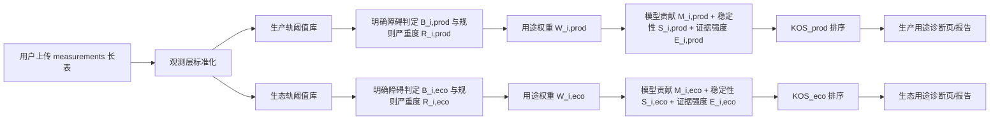
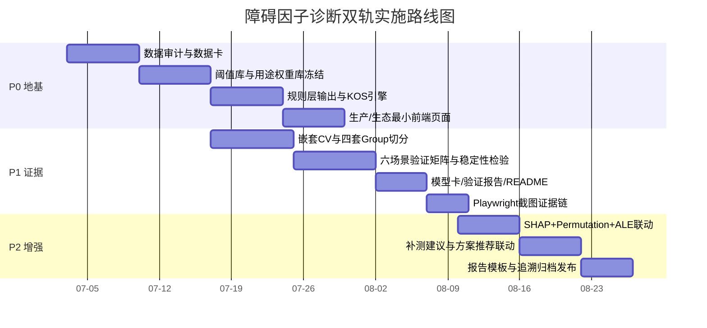

# 污染场地障碍因子诊断双轨方法学地基、验证策略与交付方案

## 执行摘要

本报告建议将“障碍因子诊断”正式定义为**高风险场景下、以规则为主导、以模型为辅助的因子归因任务**：障碍是否存在，由生产轨或生态轨对应的阈值、适宜区间或等级标准决定；关键障碍如何排序，则由规则严重度、用途权重、模型贡献度、稳定性和证据强度共同决定，而不再把“SHAP 值”直接等同于“障碍高度”。这一重构与甲方要求的“数据→结论→方案”和“一键追溯报告”一致，也能吸收课题一已形成的障碍因子集、课题二的 AHP/熵值/组合赋权成果及 SSUI 思路。当前内部方案的主要短板不是模型类型，而是数据审计未闭环、规则层与模型层边界不清、双轨差异化逻辑尚未完全落地、验证代码多为“就绪未实跑”。因此，建议先以“规则判障碍、权重定用途、模型给贡献、稳定性定关键、证据等级定可信度”为总原则，完成数据审计、双轨阈值库、KOS 评分、验证矩阵和交付规范，再决定是否扩大模型复杂度。citeturn0academia0turn0academia2turn14view0turn3view0turn4view0turn4view1 fileciteturn0file0 fileciteturn0file1 fileciteturn0file10 fileciteturn0file11

## 问题回顾与总体判断

你们现有课题成果已经具备很强的方法学基础：年度报告中已给出**127 项障碍因子、539 个应用场景**，并构建了**生产功能 28 项、生态功能 25 项**的功能重构可行性指标集，同时采用 AHP、熵值法和组合赋权，并进一步延展到 SSUI 持续利用评价。这说明“因子库—权重—评价链条”其实已经存在，不需要再从零发明。更关键的是，报告自己也承认“多数文献并未天然区分生产与生态”，因此项目曾先构建合集，再做生产/生态细分；这恰好说明当前工作的重点，应当是把**同一因子在不同用途轨道下的阈值上下文、功能层权重和解释话术**分开，而不是简单把污染指标一分为二。fileciteturn0file0

甲方需求也很明确：系统不是单一预测工具，而是要完成**数据管理、关键障碍因子识别、功能重构可行性评价、可持续利用评价、方案推荐、全流程追溯**的闭环，且追溯报告要覆盖调查评估、方案审批、施工监理、效果评估和后期管护。换言之，甲方并不只要一个“模型分数”，而是要一个**可审计、可追溯、可落地解释**的监管与决策系统。fileciteturn0file1 fileciteturn0file2

从内部冻结文档看，zzv0.4 已经迈出关键一步：它把任务改写为“因子归因而不是二分类预测”，并明确了原始观测层、规则派生层和训练任务层的三层分离；但同一份基线文件仍然保留了“SHAP 值 = 障碍高度”的表述，而执行记录又显示很多关键工作仍处于“代码就绪但未实跑”的状态，同时当前 `severity=log2(val/thr)` 的写法也无法覆盖 pH、CEC、SOC、坡度、有效土层等区间型、下限型和等级型指标。这意味着**方向是对的，地基还不够**。fileciteturn0file10 fileciteturn0file11

进一步看，方法学风险并不只来自“模型不稳”，更来自**高风险决策中把黑箱解释包装成法规判断**。Rudin 明确指出，在高风险场景下，不应把事后解释黑箱当成合规替代，而应优先采用规则或本身可解释的模型；Lundberg 与 Lee 的 SHAP 工作则说明，SHAP 解释的是特征对模型输出的加性贡献，而不是法规结论，更不是因果效应。Cawley 与 Talbot 进一步指出，如果没有严格的嵌套验证，模型选择本身就会过拟合，从而导致乐观偏差。对你们这个场景来说，这三点的共同含义是：**规则层必须先行，模型层必须降级为辅助，验证层必须严于常规 tabular ML。** citeturn0academia0turn0academia2turn14view0

## 方法学框架与量化公式

本报告建议把方法学主线写成一句话：**障碍存在性由标准与阈值决定，关键障碍排序由多证据融合决定，生产轨与生态轨共享污染因子但不共享阈值上下文、用途权重和解释目标。** 这一表述既能继承你们现有障碍因子集和可行性评价体系，也能避免把 SHAP 神化成“障碍高度”。fileciteturn0file0 fileciteturn0file10

### 总体结构

建议把“用户上传数据→诊断→报告”的链条拆成四步：先做观测数据标准化；再按用途轨调用阈值库和适宜区间库计算明确障碍；随后基于课题二权重体系、模型贡献度与稳定性计算关键障碍综合得分；最后输出正式结论、条件结论和补测建议三类结果。这样设计既满足甲方“数据→结论→方案”的链条，也与当前系统“关键障碍因子识别—功能重构可行性—持续利用评价—方案推荐”的总体结构一致。fileciteturn0file1 fileciteturn0file5 fileciteturn0file8



### 明确障碍判定

对任一因子 \(i\) 和任一用途轨道 \(t \in \{\text{production}, \text{ecology}\}\)，先定义“明确障碍存在性” \(B_{i,t}\)。核心原则是：**只有存在适用阈值、适宜区间或等级规则时，才能进入正式障碍判定。**

\[
B_{i,t} =
\begin{cases}
1, & x_i > U_{i,t} \quad \text{(上限型)} \\
1, & x_i < L_{i,t} \quad \text{(下限型)} \\
1, & x_i \notin [L_{i,t}, U_{i,t}] \quad \text{(区间型)} \\
1, & g_i \in \mathcal{G}_{\text{restricted},t} \quad \text{(等级型)} \\
0, & \text{其余情况}
\end{cases}
\]

这里的 \(U_{i,t},L_{i,t}\) 不是固定单值，而应当来自**带上下文的阈值库**：至少要包含标准来源、用途轨道、pH 路由、土壤质地条件、版本号和适用说明。年度报告已经把生产和生态指标内涵、标准值、权重表分别列出，因此阈值库不应从空白开始，而应直接映射你们已完成的表 2.6—2.21 结构。fileciteturn0file0

### 规则严重度

障碍“有无”与障碍“多严重”应彻底分离。严重度 \(R_{i,t}\) 不建议直接用裸超标倍数，因为这会让极端污染物把所有功能性指标完全淹没。推荐按指标类型分别计算。

对上限型指标，例如 Cd、Pb、PAHs、石油烃：

\[
R_{i,t}^{\text{upper}} =
\min\left(1,\frac{\log(1+x_i/U_{i,t})}{\log(1+c_i)}\right)
\]

其中 \(c_i\) 为该因子的上限截尾倍数，建议取历史 P95 超标倍数或工程固定值 10。这样做的目的不是“淡化严重污染”，而是避免一个极端点在排序中形成数值劫持。

对下限型指标，例如 SOC、CEC、有机质、有效土层厚度、发芽指数：

\[
R_{i,t}^{\text{lower}} =
\min\left(1,\frac{\log(1+L_{i,t}/x_i)}{\log(1+c_i)}\right)
\]

对区间型指标，例如 pH、含盐量、电导率：

\[
R_{i,t}^{\text{interval}} =
\begin{cases}
0, & x_i \in [L_{i,t},U_{i,t}] \\
\min\left(1,\frac{L_{i,t}-x_i}{d^-_{i,t}}\right), & x_i < L_{i,t} \\
\min\left(1,\frac{x_i-U_{i,t}}{d^+_{i,t}}\right), & x_i > U_{i,t}
\end{cases}
\]

对等级型指标，例如坡度、剖面构型、障碍层、灌排条件，则按规范等级映射为 \(\{0,0.25,0.5,0.75,1\}\) 或项目自定义等级数值。这样一来，`severity=log2(val/thr)` 只保留在极少数上限型污染因子内作为特例，而不再作为总公式。fileciteturn0file11

### 用途权重

用途权重 \(W_{i,t}\) 不应凭经验拍脑袋，而应当直接锚定课题二的可行性评价指标权重。年度报告已经给出生产与生态两套准则层、指标层、AHP、熵值法和组合权重表，因此系统里应把这些成果转写为机器可读权重库，而不是再发明一套“RF 内生权重”。fileciteturn0file0

推荐定义为：

\[
W_{i,t} = \text{Normalize}\left(
\lambda_1 \cdot W^{\text{criterion}}_{c(i),t} +
\lambda_2 \cdot W^{\text{indicator}}_{i,t} +
\lambda_3 \cdot P^{\text{standard}}_{i,t}
\right)
\]

其中 \(c(i)\) 为因子所属功能层，\(P^{\text{standard}}_{i,t}\) 表示标准优先级修正项；默认可取 \(\lambda_1=0.5,\lambda_2=0.4,\lambda_3=0.1\)，但须做敏感性分析。更重要的是，**污染指标在生产轨和生态轨都必须保留**，区别只是权重和解释目标不同：生产轨优先考虑食用安全、作物吸收、肥力与根系条件；生态轨优先考虑生态毒性、植被恢复、结构水文、生物活性和生态服务。年度报告把这种差异已经体现在生产与生态指标分类表和权重表里。fileciteturn0file0

### 规则指数与模型目标

如果模型层仍然存在，建议模型不再直接学习“是否障碍”的二分类，而是学习**用途轨专属的规则障碍指数** \(OI_t\)。这是把规则层与模型层连接起来的最稳妥方式。

\[
OI_t = \frac{\sum_i B_{i,t}\cdot R_{i,t}\cdot W_{i,t}\cdot D_{i,t}}{\sum_i W_{i,t}\cdot D_{i,t}}
\]

其中 \(D_{i,t}\) 为检测可用性指示变量：已检测取 1，未检测取 0。这样，未检测指标不会被伪装成“正常”，而是自然退出正式评分，同时进入“建议补测”。这一点对生态轨尤其重要，因为生态指标往往更稀疏。fileciteturn0file0

### KOS 定义与参数化

关键障碍综合得分 KOS 只在 \(B_{i,t}=1\) 的前提下计算，即**先是障碍，才谈关键程度**。建议使用以下形式：

\[
KOS_{i,t} = B_{i,t}\cdot\left(
0.30R_{i,t} + 0.25W_{i,t} + 0.15M_{i,t} + 0.20S_{i,t} + 0.10E_{i,t}
\right)
\]

这里的五个分量建议这样量化：

\[
M_{i,t} = \frac{\mathbb{E}(|SHAP_{i,t}|)}{\sum_j \mathbb{E}(|SHAP_{j,t}|)}
\]

\[
S_{i,t} = 0.35F_{i,t}^{\text{point}} + 0.25F_{i,t}^{\text{spatial}} + 0.25F_{i,t}^{\text{bootstrap}} + 0.15F_{i,t}^{\text{version}}
\]

\[
E_{i,t}\in\{1.0,0.75,0.40,0.10\}
\]

分别对应 A/B/C/D 四级证据强度：A 为“本场地实测 + 国家/行业标准”，B 为“本场地实测 + 地方/工程阈值”，C 为“文献支持但未测”，D 为“弱证据或代理变量”。正式 Top-N 仅允许 A/B 级进入。这样做的直接好处，是把“文献不一致”的争议降级成权重和补测问题，而不是让文献替代实测数据。fileciteturn0file0

### 模型贡献度的定位与替代解释

SHAP 的定位必须重写为：**模型贡献度，不是法规判断，不是因果强度，不是天然的障碍高度。** Lundberg 与 Lee 证明了 SHAP 在加性特征归因框架中的性质；Rudin 则提醒高风险决策不应让黑箱解释替代本体可解释性。对于你们的系统，最稳妥的表达是：**规则层给出“为什么构成障碍”，模型层只补充“在当前模型里，该因子对用途轨障碍指数贡献多大”。** citeturn0academia2turn0academia0

同时，要明确 SHAP 也不是万无一失。对于强相关特征，Permutation importance、PDP 及部分归因方法都可能因为打破真实联合分布而产生误导；scikit-learn 文档已提示相关特征下 permutation 结果可能接近“都不重要”，Hooker 等人则进一步指出“无约束打乱”会强迫模型外推，Apley 与 Zhu 提出的 ALE 正是为在相关特征条件下替代 PDP 而设计。对你们系统而言，最佳实践应是：**SHAP 做主解释，held-out permutation 做对照解释，ALE 用于 pH、SOC、CEC、含盐量等强相关变量的效应图。** citeturn4view3turn4view4turn18academia0turn15academia1

## 数据治理与可用性审计

当前内部文档虽然把 `merged_std33_geocoded.csv` 明确定义成原始观测层，并强调“只读、保留检出限语义”，但执行记录也承认：嵌套 CV、六场景验证、标签审计、模型卡与数据卡大多只是代码到位、结果未跑。也就是说，现在还不能对外说“27031 行数据已经是可训练、可验收、可泛化”的 model-ready 表。这个缺口必须先补。fileciteturn0file10 fileciteturn0file11

建议把数据治理作为 **P0**，产出一个正式的 `data/reports/merged_std33_geocoded_data_audit.md`。下表给出可直接落地的审计模板。

| 审计项 | 关键问题 | 建议脚本/Notebook | 产出物 | 通过阈值 |
|---|---|---|---|---|
| 数据概况 | 总行数、列数、场地数、来源数、地区数是否一致 | `notebooks/data_audit_merged_std33.ipynb` | `dataset_profile.json` | 与原始台账一致 |
| 主键完整性 | `site_id / sample_id / factor_id / time` 是否可唯一定位 | `scripts/check_primary_keys.py` | `pk_integrity.csv` | 唯一率 100% |
| 缺失率 | 每列、每因子、每轨道缺失率如何 | `scripts/check_missingness.py` | `missingness_report.csv` | 核心字段缺失率 < 5% 或说明原因 |
| 检出限语义 | `<0.001`、ND、未检出 是否保留原文与数值映射 | `scripts/parse_censored_values.py` | `censoring_audit.csv` | 原文保留率 100% |
| 单位统一 | mg/kg、g/kg、% 等是否统一换算 | `scripts/unit_harmonization.py` | `unit_conversion_log.csv` | 无冲突单位残留 |
| 异常值 | 物理不可能值、单位错位、数量级跳变是否存在 | `scripts/outlier_screen.py` | `outlier_candidates.csv` | 全部复核闭环 |
| 重复/平行样 | 重复样、平行样、复测样如何合并与保留 | `scripts/replicate_resolution.py` | `replicate_resolution.md` | 规则明确、可追溯 |
| 地理 QA | 经纬度是否可用、行政区映射是否正确 | `scripts/geocode_qc.py` | `geo_qc_report.csv` | 坐标异常率 < 1% |
| 轨道覆盖 | 生产轨与生态轨核心指标覆盖率分别是多少 | `scripts/check_track_coverage.py` | `track_coverage.csv` | 核心指标覆盖率可解释 |
| 阈值覆盖 | 哪些因子有国家/工程阈值，哪些没有 | `scripts/check_threshold_coverage.py` | `threshold_coverage.csv` | 每因子状态明确 |
| 标签可用性 | 哪些记录可生成 \(B,R\)，哪些只能建议补测 | `scripts/generate_rule_labels.py` | `rule_label_audit.csv` | 不得把未测记作 0 |
| model-ready 视图 | 最终入模字段、剔除字段及理由 | `scripts/build_model_ready_view.py` | `model_ready_schema.md` | 字段清单冻结 |

上面这套审计模板之所以必须放在 P0，是因为 scikit-learn 官方对泄露的要求非常明确：**先切分，再拟合任何变换器；`fit` 和 `fit_transform` 绝不能在测试集上运行；Pipeline 是防止预处理穿越训练/测试边界的标准手段。** 这意味着你们所有的标准化、缺失填补、特征选择、阈值调优和 Top-K 截断规则都必须放进可复现 pipeline 或 fold 内操作。citeturn3view0

在标签设计上，也必须澄清“规则派生层是不是给所有指标打标签”的问题。答案是不需要。只有**存在适用阈值或适宜区间**的指标才生成 \(B_{i,t}\) 和 \(R_{i,t}\)；仅有领域重要性但没有可靠阈值的指标，进入“候选解释因子”或“建议补测因子”。这尤其适用于生态轨中微生物、酶活性、发芽指数、植被建立等低覆盖但高解释价值指标。年度报告已经显示，生产与生态指标并不完全重合，而且生态功能相关指标更依赖场地细化采样。fileciteturn0file0

建议直接建立以下脚本骨架，并在仓库中与报告一起提交：

```text
notebooks/data_audit_merged_std33.ipynb
scripts/build_threshold_library.py
scripts/build_factor_dictionary.py
scripts/check_track_coverage.py
scripts/build_model_ready_view.py
ml/pipelines/train_dual_track.py
ml/validation/run_validation_matrix.py
ml/governance/export_model_card.py
frontend/e2e/capture_ui_audit.spec.ts
```

这一组脚本的验收原则应当很简单：给出相同输入，必须能稳定重现同一份数据卡、同一版阈值库、同一版 model-ready schema 和同一版验证报告。citeturn3view0turn4view0

## 验证策略与稳定性复现性检验

当前方案最大的问题不是“没有验证框架”，而是**验证框架尚未真正跑完**。内部执行记录已明确：嵌套 CV、四套 group 切分、六场景验证、标签审计、模型卡/数据卡大多仍是“代码就绪”，尚未形成可审核结果。因此，这一阶段不应继续用“模型准确率”做宣传，而应把重点转到**分组泛化、排序稳定性、双轨逻辑一致性和人工复核触发机制**。fileciteturn0file11

Cawley 与 Talbot 已经说明，若在同一套数据上同时做模型选择和性能评价，模型选择过程本身就会过拟合，导致后续评估出现明显的选择偏差；scikit-learn 也明确建议在内部交叉验证中单独调优决策阈值，并警告不要在训练同一数据上再调阈值。对你们来说，这意味着：外层必须只负责泛化评估，内层才允许调超参数和阈值。citeturn14view0turn4view1turn4view2

在切分策略上，GroupKFold 是你们场景最合适的默认起点，因为它保证同一 group 只会出现在一次测试折中。由于污染场地数据本质上有“同场地多样点、同来源多文章、同区域多项目”的结构，最少应并行做四套 group：`site_id`、`DOI/Source`、`province/region`、`sampling_campaign`。只有这样，才能判断模型到底是在学“跨场地规律”，还是在记忆论文来源、地区背景或采样批次。citeturn4view0turn3view0

验证矩阵建议如下。

| 验证维度 | 设计方式 | 主要指标 | 通过标准 | 备注 |
|---|---|---|---|---|
| 外层泛化 | `GroupKFold(site_id)` | MAE/RMSE/Spearman、Top-5 Precision | 生产/生态两轨均稳定 | 主评估 |
| 来源泛化 | `GroupKFold(source_or_doi)` | Top-K Jaccard、Rank Corr | 不显著劣化 | 防文献泄露 |
| 区域泛化 | Leave-One-Region-Out | Top-K Recall、Kendall τ | 各区均可解释 | 防地域记忆 |
| 场景泛化 | HM/OP/HM+OP × 生产/生态 | 6 场景分层指标 | 至少 4 场景稳定 | 不足场景需降级 |
| 阈值调优 | 内层 CV 调阈值 | F1 / cost-sensitive metric | 只在内层执行 | 禁止 test 调阈值 |
| 排名稳定性 | Bootstrap 500 次 | Top-5 入榜率、KOS CI | Top-5 入榜率 ≥ 0.70 | 关键障碍必须稳定 |
| 解释对照 | SHAP + held-out permutation + ALE | 排名一致性 | 前 3 名高度一致或可解释差异 | 相关特征要审慎 |
| 标签质量 | Confident Learning | 疑似错标率 | 高风险样本全部复核 | 仅辅助，不自动改标签 |
| OOD 检测 | IsolationForest / distance-based | OOD 分数 | 高 OOD 触发人工复核 | 用于陌生场景 |
| 双轨一致性 | 生产 vs 生态同步跑 | 解释路径差异 | 不要求 Top-K 必然不同 | 严禁“强行差异” |

关于“生产轨和生态轨结果相同是不是失败”，这里必须重新立规矩。**不要求 Top-K 必然不同；只要求两条轨道的阈值上下文、权重库和解释目标是真实分开的。** 如果某场地 Cd、As、Pb 极度超标，那么两轨都把这些污染物排在前面完全合理；只有当两轨不仅 Top-K 相同，而且阈值、权重、解释文案都几乎一模一样时，才应触发红旗。当前内部文档里把“生产/生态异常一致”直接当成复核条件，这个规则需要修订成“**一致但无轨道逻辑差异**才复核”。fileciteturn0file10 fileciteturn0file11

在不确定性表达上，不建议继续迷恋单一 AUC。对你们这种“排序型、高风险、证据链要求高”的任务，更应该给出 Top-K 的稳定区间和 KOS 的置信区间。Conformal prediction 可以为模型层输出提供分布无关的不确定性区间；Northcutt 的 confident learning 则适合做标签质量排查，而不是直接替代人工复核。citeturn7academia3turn16academia1turn16academia0

建议把训练与验证流水线固化为下述伪流程：

```text
1) 数据切分：outer split by group
2) outer-train 内：
   2.1 构建阈值路由与规则标签
   2.2 fit 预处理器/填补器/特征筛选器
   2.3 inner CV 调参 + 调阈值
   2.4 训练规则指数回归/排序模型
3) outer-test：
   3.1 仅 transform，不 fit
   3.2 输出 OI_t、KOS_t、Top-K
   3.3 计算 SHAP、held-out permutation、ALE
4) 聚合所有 outer folds：
   4.1 Top-K 稳定性
   4.2 场景/地区/来源切片
   4.3 Bootstrap CI
   4.4 生成 model card / validation report
```

对应的最小测试用例如下：第一，完整数据集和打乱标签数据集各跑一次，后者性能应接近随机；第二，故意把 `fit_transform` 放到全数据上，验证脚本必须报警；第三，复现同一模型三次，Top-5 核心障碍不应大幅飘移；第四，对同一严重污染场地执行生产/生态两轨，允许共享重污染物，但解释层必须给出不同用途目标。citeturn3view0turn14view0turn4view1

## 前端报告输出规范与甲方可解释话术

甲方要的是可监管、可审批、可追溯的系统，而不是一个算法演示台。甲方需求已明确要求单场地/多场地统计分析、关键障碍因子识别、功能重构可行性评价、可持续利用评价、方案推荐和一键追溯报告；需求确认问卷和设计说明书又进一步确认了前端技术栈、角色权限、多阶段审批流和地图、图表、报告等组件。这意味着前端输出必须围绕“**当前用途、明确障碍、关键障碍、补测建议、推荐措施、证据链**”组织，而不应该默认暴露 SHAP、OOD、feature schema hash 这类技术细节。fileciteturn0file1 fileciteturn0file2 fileciteturn0file4 fileciteturn0file5

建议用户界面不再做默认“双轨对比页”，而是提供两个清晰入口：**生产用途诊断**与**生态用途诊断**。这样一来，用户天然知道自己在看哪种修复后用途的结论，系统也无须通过视觉对比去“证明自己分得开”。这一点与你前面提出的要求完全一致。fileciteturn0file1 fileciteturn0file10

建议每个用途页面固定输出如下六块：

| 模块 | 页面展示建议 | 是否对甲方默认展示 |
|---|---|---|
| 当前用途 | 生产用地 / 生态用地 | 是 |
| 数据覆盖 | 已检测点位、已检测指标、未检测关键指标 | 是 |
| 明确障碍因子 | 基于阈值或区间规则的正式障碍清单 | 是 |
| 关键障碍因子 | 基于 KOS 的优先处置清单 | 是 |
| 建议补测指标 | 未检测但对当前用途重要 | 是 |
| 技术详情 | 数据版本、规则版本、模型版本、解释快照 | 折叠显示 |

报告页建议分成三段结论：**强结论、条件结论、建议补测**。强结论仅接受“已测 + 有阈值 + 稳定出现”的因子；条件结论用于“已测但证据略弱或轨道差异敏感”的因子；建议补测用于“用途高度相关但未测”的因子。这样既能避免过度承诺，也更符合监管报告的表达习惯。fileciteturn0file1 fileciteturn0file5

面向甲方的解释话术建议固定为以下版本，可直接写入报告模板：

> 本次诊断首先依据当前修复后用途调用对应阈值与适宜区间，判断哪些指标已经构成明确障碍；随后结合该指标对当前用途的重要性、在场地中的出现范围、不同批次的稳定性，以及模型对用途障碍指数的解释贡献，形成关键障碍排序。  
> 生产用途和生态用途不是换个标题重复计算，而是使用不同的用途目标、阈值上下文和权重体系。污染物在两条路径中都会被关注；区别在于生产用途更强调安全生产、作物吸收和土壤肥力，生态用途更强调生态毒性、植被恢复、土壤结构、生物活性和生态服务。若某些功能性指标未检测，系统不会编造差异，而会明确列为建议补测项。

这一话术的优势在于：它把“强污染物可以在两轨同时靠前”解释成合理现象，而不是系统故障；同时又把双轨差异真正落在阈值上下文、权重和用途目标上。fileciteturn0file0 fileciteturn0file1

为了形成可验收 UI 证据链，建议 Playwright 截图剧本只保留少数关键场景，并强制真实渲染，不允许拼图。最少应包括：生产用途诊断页、生态用途诊断页、建议补测弹窗、单场地追溯报告预览、权限隔离页、地图点位页。脚本文件建议命名为 `frontend/e2e/capture_ui_acceptance.spec.ts`，并在 README 中逐一列出“页面路径—角色—证明的验收点—是否含演示数据—是否可用于甲方演示”。甲方只需要看结果页、报告页和追溯页；内部审计细节放在技术详情区。fileciteturn0file1 fileciteturn0file4

## 实施路线图、交付物与验收标准

建议把实施拆成三层优先级。**P0 做地基**：数据审计、阈值库、因子字典、双轨权重库、规则层输出、前端最小页面；**P1 做证据**：嵌套验证、六场景矩阵、稳定性报告、模型卡/数据卡、Playwright 证据；**P2 做增强**：ALE、对照解释、方案推荐联动、追溯归档自动化。这样安排的核心原因，是目前最危险的问题不是功能少，而是“方法学地基高级但证据不闭环”。fileciteturn0file10 fileciteturn0file11



建议的里程碑与验收标准如下。

| 里程碑 | 关键交付 | 验收标准 |
|---|---|---|
| M1 数据可用性冻结 | `data_audit.md`、`dataset_card.md`、`model_ready_schema.md` | 所有字段覆盖率、缺失率、阈值覆盖率、轨道覆盖率可复核 |
| M2 双轨规则层冻结 | `threshold_library_prod.csv`、`threshold_library_eco.csv`、`factor_dictionary.yaml` | 同一输入能稳定输出生产/生态两套明确障碍 |
| M3 KOS 引擎上线 | `kos_engine.py`、`rules_engine.py` | Top-N 明确障碍与关键障碍均可解释，未测项不进正式榜 |
| M4 验证报告出具 | `validation_report.md`、`model_card.md` | 嵌套 CV、四类 group 切分、Bootstrap CI、六场景最少四场稳定 |
| M5 前端验收 | 生产页、生态页、追溯报告页、Playwright 截图 | 页面路径与 README 描述完全一致，可复现渲染 |
| M6 交付版归档 | README、截图证据、报告模板、压缩包 | 甲方角色可看懂，技术细节折叠，证据链齐全 |

建议的交付物清单如下。

| 交付物 | 存放建议 | 必须包含内容 | 最低验收准则 |
|---|---|---|---|
| 数据审计报告 | `data/reports/` | 缺失、异常、单位、阈值覆盖、轨道覆盖 | 能回答“哪些数据能训、哪些不能” |
| 阈值库与因子库 | `data/thresholds/` `data/factors/` | 标准来源、版本、上下文条件 | 可机读、可追溯 |
| 训练流水线 | `ml/pipelines/` | outer/inner CV、阈值调优、防泄露 pipeline | 一键可跑 |
| 验证报告 | `docs/reports/` | 6 场景、4 组切分、Bootstrap、CI | 不得只写“代码就绪” |
| 模型卡/数据卡 | `docs/governance/` | 用途边界、训练来源、局限性 | 可交付评审 |
| 前端截图证据 | `docs/audit/screenshots/` | README、页面路径、角色、验收点 | 文件名与画面一致 |
| 追溯报告模板 | `docs/templates/` | 强结论/条件结论/建议补测 | 可直接套打 |
| 部署与自测说明 | `README.md` | 环境、命令、已知问题、回滚方式 | 他人可复现 |

风险与回滚策略也必须提前写清楚。第一类风险是**数据稀疏导致生态轨不稳定**；回滚方案是降级为“规则层 + 建议补测”，暂不展示模型贡献。第二类风险是**双轨差异不明显**；回滚方案不是强行造差异，而是把报告改为“同一重污染物同时制约生产与生态”，并突出用途目标差异。第三类风险是**模型贡献与规则严重度大幅冲突**；回滚方案是保留规则结论、隐藏 KOS 中的模型分量，直到解释审计通过。第四类风险是**验证无法完成或过慢**；回滚方案是先交付规则层与可解释统计基线，再把树模型作为二期增强。这个回滚逻辑，与 Rudin 对高风险场景优先可解释框架的建议是一致的，也能规避 Cawley 所说的“验证未闭合却先宣传性能”的问题。citeturn0academia0turn14view0

## 核心参考文献与 RIS 附件说明

本报告优先使用了你方已上传的年度报告、甲方需求、需求确认问卷、系统设计说明书、内部冻结任务定义和执行记录作为**项目内证据**，并以国家标准、JMLR、NeurIPS、Nature Machine Intelligence、scikit-learn 官方文档和原始方法论文作为**方法学外部证据**。其中最关键的引用包括：GB 15618-2018、GB 36600-2018、Lundberg & Lee 2017、Rudin 2019、Cawley & Talbot 2010、Apley & Zhu 2020、Mitchell et al. 2019、Gebru et al. 2018、Northcutt et al. 2019/2021、Probst et al. 2019、Hooker et al. 2019，以及 scikit-learn 关于数据泄露、GroupKFold、阈值调优和 permutation importance 的官方文档。citeturn0academia0turn0academia2turn14view0turn15academia1turn16academia3turn15academia0turn16academia1turn16academia0turn7academia0turn18academia0turn3view0turn4view0turn4view1turn4view3

已按本报告核心参考文献生成 RIS 文件与压缩包，可直接下载：

[核心参考文献 RIS 文件](sandbox:/mnt/data/dual_track_obstacle_methodology_core_refs.ris)

[核心参考文献 RIS 压缩包](sandbox:/mnt/data/dual_track_obstacle_methodology_core_refs_ris_pack.zip)

如需在下一轮扩展为“**中文标准 + 土壤生态修复专题 + 生物有效性 + 组合赋权**”的完整版 RIS 包，应继续补充重金属有效态、生物可利用性、PAHs 有机碳吸附、微生物与酶活性指标、AHP/CRITIC/博弈组合赋权等专题文献；但就当前“系统地基、验证策略、交付方案”而言，上述核心包已经足够支撑报告撰写、评审答辩与系统交付。